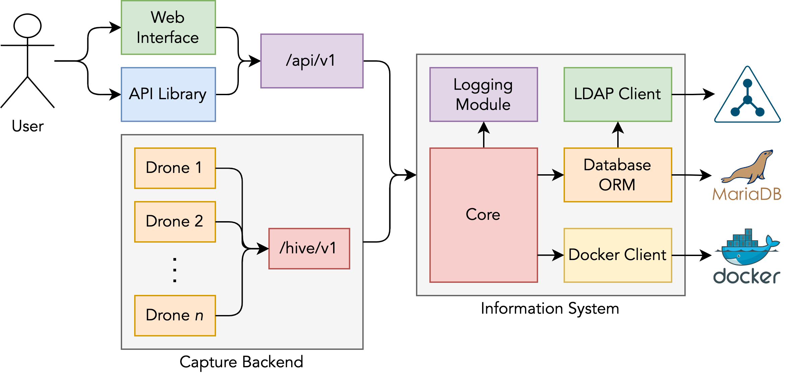

# System Architecture

The Traffic Capture Infrastructure (TCI) system takes inspiration from the existing network flow systems and is composed of multiple interconnected modules; an overview of which can be seen in the diagram below.

The traffic capture itself is managed by the TCI hive and the TCI drones, which work similarly to a flow collector and exporter respectively.
This backend captures the traffic using 1 to *n* drones.
The captured data is then collected and merged using the TCI hive.

The information system can be accessed using the angular web interface or using one of the supplied API libraries.
Using the web interface to access the TCI system gives the users full access to all the underlying features and is the default way of interacting with the system.
However, in cases where a degree of automatization is required (such as when capturing network incidents), the system can be fully controlled using one of the API libraries.

The whole TCI system is written in Python using the Flask framework.
Flask was selected due to its lightweight size and large number of extension libraries.
The system uses SQLAlchemy as an ORM which gives us the flexibility of deploying the system using a large number of available database backends.
The web interface was built using Angular.
